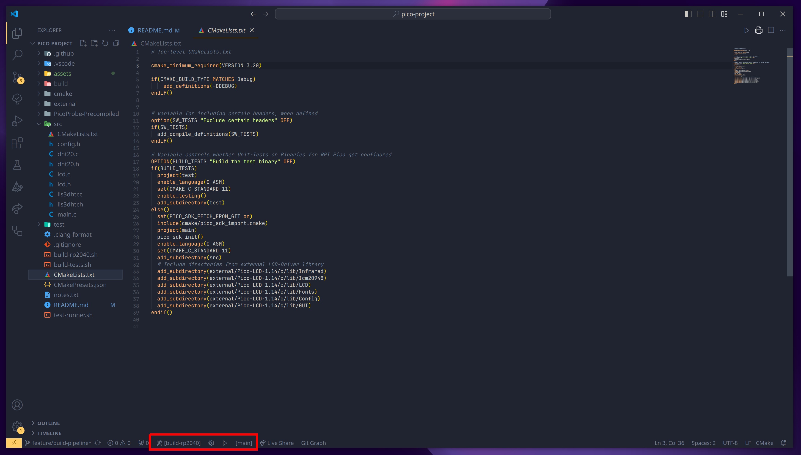
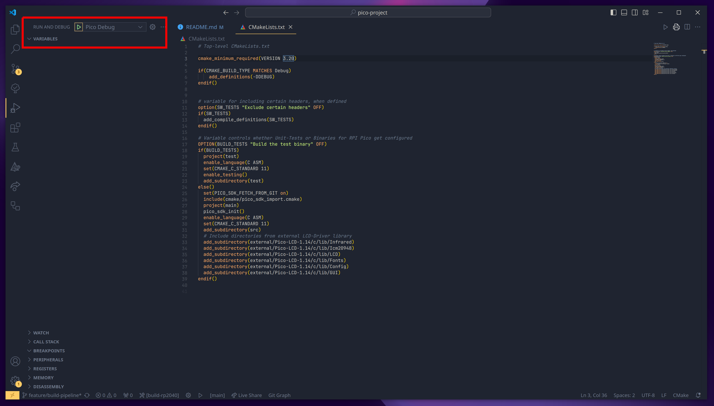
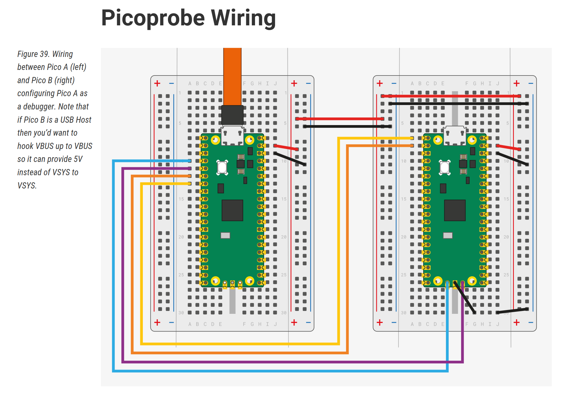

# Pico Project
**Template project for developing software for Raspberry Pi Pico in C.**


## Getting started/Prerequisites :rocket:

Additional documentation: [Official getting started PDF](https://datasheets.raspberrypi.com/pico/getting-started-with-pico.pdf)

### Hardware

- Raspberry Pi Pico (2 when Debugging with Pico-Probe)
- Jumper-Cables
- LIS3DHTR and DHT20 Sensor (Included in Seeed Arduino Sensor Kit)
- Pico-LCD 1.14 Inch
- Micro-USB to USB-A Cable
- [Raspberry Pi Pico Datasheet](https://datasheets.raspberrypi.com/pico/pico-datasheet.pdf)

### Wiring
- Sensor GND to Pico GND
- Sensor VCC to Pico VCC
- Sensor SDA to Pico GP16
- Sensor SCA to Pico GP17

### IDE/Code-Editor
- Prefered Editor/IDE is [Visual Studio Code](https://code.visualstudio.com/) but it works in every other Editor/IDE.

- Extensions you need to install in Visual Studio Code
  - [CMake Tools](https://marketplace.visualstudio.com/items?itemName=ms-vscode.cmake-tools)
  - [Microsoft C/C++](https://marketplace.visualstudio.com/items?itemName=ms-vscode.cpptools)
  - [Cortex-Debug](https://marketplace.visualstudio.com/items?itemName=marus25.cortex-debug)

## Install Instructions for Linux :penguin:
- [Link to Instructions](Install-Linux.md)

## Install Instructions for Windows
- [Link to Instructions](Install-Windows.md)

## How To Build Template-Project :hammer:

### Building Template in Visual Studio Code
  


- :hammer_and_wrench: Selecting Preset Configuration
- :gear: Building selected Preset Configuration
- :arrow_forward: Executing selected launch target **(Only for Unit Testing Preset)**
- [main] Selecting launch target **(Only for Unit Testing Preset)** 

### Building RPI Pico Executable From Command-Line
When building from the command-line you have to execute
```shell
cmake --preset "rp2040"
cmake --build --preset "rp2040"
```
or execute the build script inside Linux or the Pipeline
```shell
./build-rp2040.sh
``` 
in order to configure and compile the project executable for the Raspberry Pi Pico. 
 
### Flashing Raspberry Pi Pico
After compiling, the executable will be located in **build/rp2040/bin/** folder. 
Plugin the Pico into your PC while pressing and holding the BOOTSEL-Button. The Pico will be mounted as a external drive. Then you can drag-and-drop **main.uf2** located in the build-folder onto the mounted drive. 

### Automatic Flashing 
For automatic uploading you can use the existing task in VS Code
- Type 'Ctrl + P' and type **task** into the Command Palette.
- Select **Tasks: Run Task** and select **Upload to Pico**.
- This will automatically build and upload the binaries to the pico.
- Alternative in the Terminal without VS Code:
```shell
cd build/rp2040
ninja upload
```

## Unit-Testing From Command-Line
When you want to execute the Unit-Tests from command-line you have to execute
```shell
cmake --preset "test"
cmake --build --preset "test"
cd build/test
ctest -VV
```
or 
```shell
./build-tests.sh
cd build/test
ctest -VV
```
The test-runner.sh script is used in GitHub Action Continous-Integration-Pipeline but you can also use this script to compile and execute the Unit-Tests.


## How To Debug With Pico Probe
After installing the dependencies from the sections above you can follow these steps on how to configure Debugging and automated flashing for the Raspberry Pi Pico. 

### Pico Probe 

- **(Only with Linux required)** Open a new terminal window and type: ```sudo openocd -f interface/cmsis-dap.cfg -c "adapter speed 5000" -f target/rp2040.cfg -s tcl```
- This will start openocd and opens a port for gdb to listen to.
 
- :arrow_forward: Start Debugging and Automatic Flashing
- **Important**: before starting to debug you have to build manually with the build-script or [build with VS-Code](#building-template-in-visual-studio-code)

- **When it is not working you can find instructions [here](https://www.digikey.de/en/maker/projects/raspberry-pi-pico-and-rp2040-cc-part-2-debugging-with-vs-code/470abc7efb07432b82c95f6f67f184c0).**


### How To Connect RPI Pico and Sensors
- SDA: to GP16 on the right Pico
- SCL: to GP17 on the right Pico
- VCC: to 3V3 on the right Pico
- GDN: to GND on the right Pico
- Connnect both LIS3DHTR and DHT20 Sensor to I2C-Bus.
- Connect both Picos like this: (Pico on the left is Debug Probe)

*Image Source: [Raspberry Pi]([source_link_here](https://datasheets.raspberrypi.com/pico/getting-started-with-pico.pdf))*


## How To Use Template For Your Own Projects

### Adding Source Code

- When adding source code, add all Source- and Header-Files inside the **src** folder. 
- When you are using specific Raspberry Pi Pico Libraries from the SDK you have to add them into CMakeLists.txt inside **src** folder.
- You can add external libraries to the **external** folder. **Important**: You must add the library path to CMakeLists.txt inside **src** folder and link them.

### Adding Unit Tests

- We are using the cmocka test framework. More documentation [here](https://api.cmocka.org/index.html).
- Inside the **test** folder are the unit tests for the **LIS3DHTR** and **DHT20** sensors as an example. Copy and paste one of these folders inside the **test** directory and rename to your own written sensor library. 
- Change the executable name to the name of your sensor inside CMakeLists.txt in the previous copied directory.
- Add your new created subdirectory to **test/CMakeLists.txt**.
- When using specific Raspberry Pi Pico functions only available in the SDK you have to declare the function inside the **prototypes.h** so that you can compile. Also write a wrapper function like in **mocks** directory to mock the Raspberry Pi functions. **Important**: Add the wrapped function to the link-flags inside CMakeLists.txt.
- Look inside the source code for reference.
- **Don't** change any other CMakeLists.txt files.

## License Notice

Pico-SDK is licensed under **BSD 3-Clause "New" or "Revised" License**
- [View license](https://github.com/raspberrypi/pico-sdk/blob/master/LICENSE.TXT)

cmocka Unit Testing Framework is licensed under **Apache-2.0 License**
- [View license](https://github.com/clibs/cmocka?tab=Apache-2.0-1-ov-file#readme)


